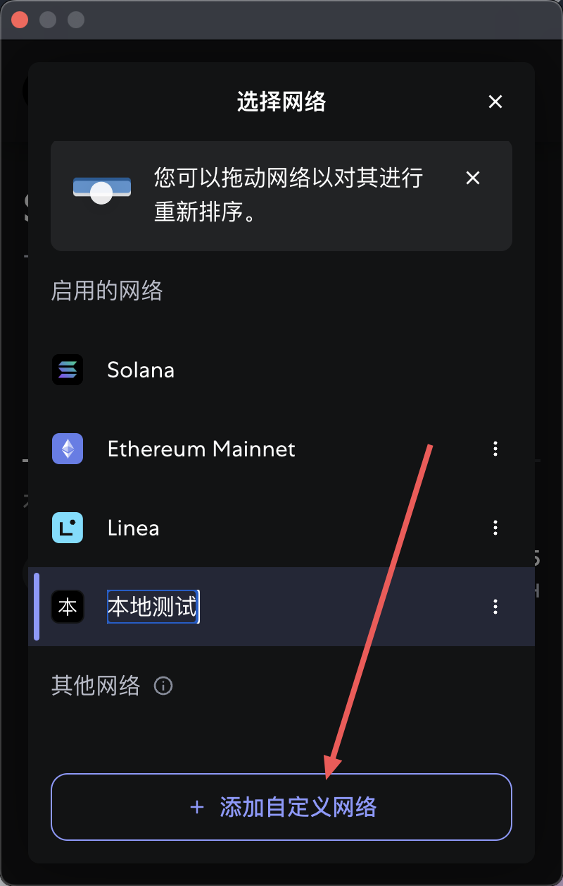
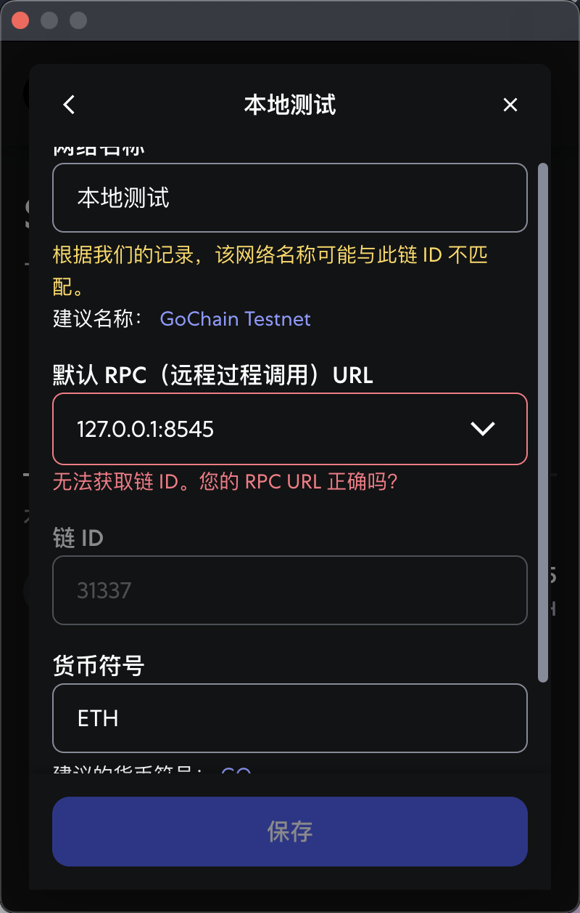
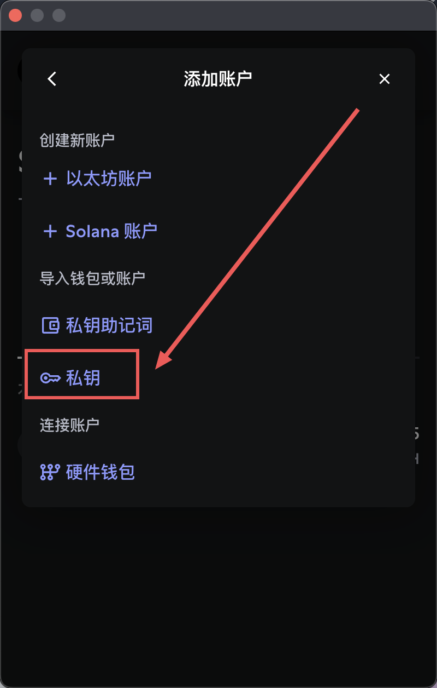

# 赏金猎人系统运行指南

## 注意事项

建议启用两个浏览器来操作。否则切换账号时，如果在另一个标签页重新登录，前一个会话可能失效。

## 1. 启动后端与本地链

### 1.1 进入 `back-end` 目录并安装依赖

```bash
cd back-end
npm install
```

### 1.2 启动 Hardhat 本地节点（第 1 个终端）

```bash
npx hardhat node
```

### 1.3 部署合约（第 2 个终端）

```bash
npx hardhat run scripts/deploy.js --network localhost
```

### 1.4 启动后端服务（第 3 个终端）

```bash
node server.js
```

## 2. 启动前端服务

```bash
cd ../front-end
npm install
npm run dev
```

## 3. 浏览器打开前端链接

启动完成后，在浏览器中打开前端输出的本地开发地址。

## 4. 配置 MetaMask 本地 Hardhat 网络

将 MetaMask 配置到本地 Hardhat 网络，并导入 Hardhat 生成的 20 个测试账号。









   
